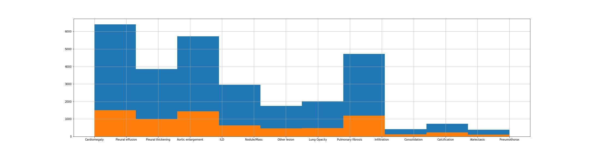

# MASK R-CNN Implementation

## Convert to 512 jpg
After converting to 512 jpg files, we received 4395 images in jpg format and the .csv files as follow

To implement MaskRCNN, the mask coordinate need to be converted to the encoded pixel as follow

File [inspect_data](inspect_data.ipynb) compare the encoded pixel with Mask RCNN formart and original dicom format.

## Training 

Using stratifield kfold to divide train/ val set

File [training_augmentation_kfold.ipynb](training_augmentation_kfold.ipynb) shows step-by-step implement MaskRCNN with augmentation and k-fold split data.
## Inspect trained model

[model_evaluation](model_evaluation.ipynb) performed model evaluation with test dataset

## Sample submission
- Using pretrained model at epoch 27 
- Using binary classication model for second step filter
$$-> LB: 0.125$$

## Some notes for improving model:
1. Develop binary classication model: Normal VS Abnormal
2. Tuning model parameter and change backbone 
3. Check bbox fussion for training and testing step
4. Using stratified k-fold
5. TTA 