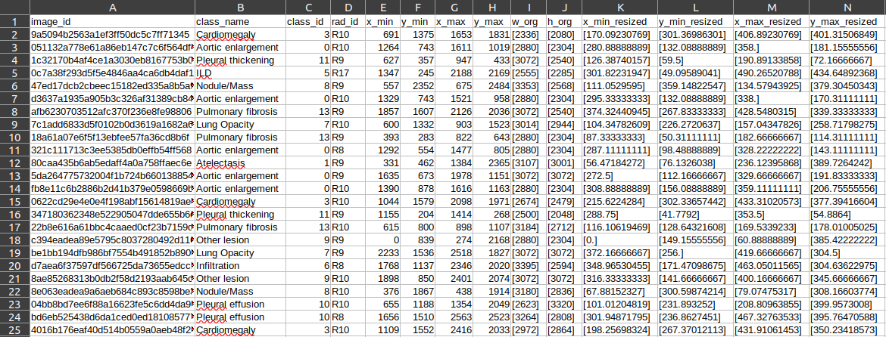
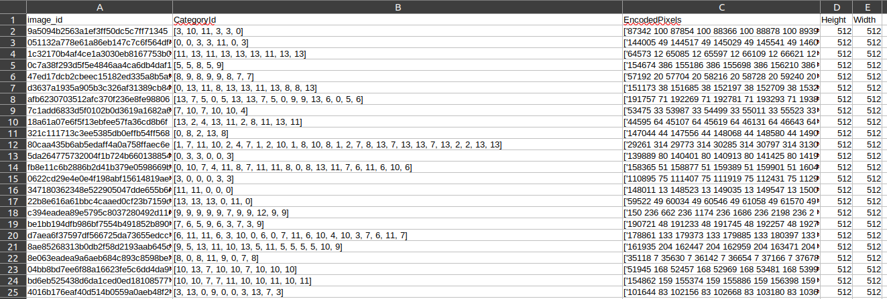

# MASK R-CNN Implementation

## Convert to 512 jpg
After converting to 512 jpg files, we received 4395 images in jpg format and the .csv files as follow

To implement MaskRCNN, the mask coordinate need to be converted to the encoded pixel as follow

File [inspect_data](inspect_data.ipynb) compare the encoded pixel with Mask RCNN formart and original dicom format.

## Training 

