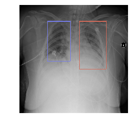
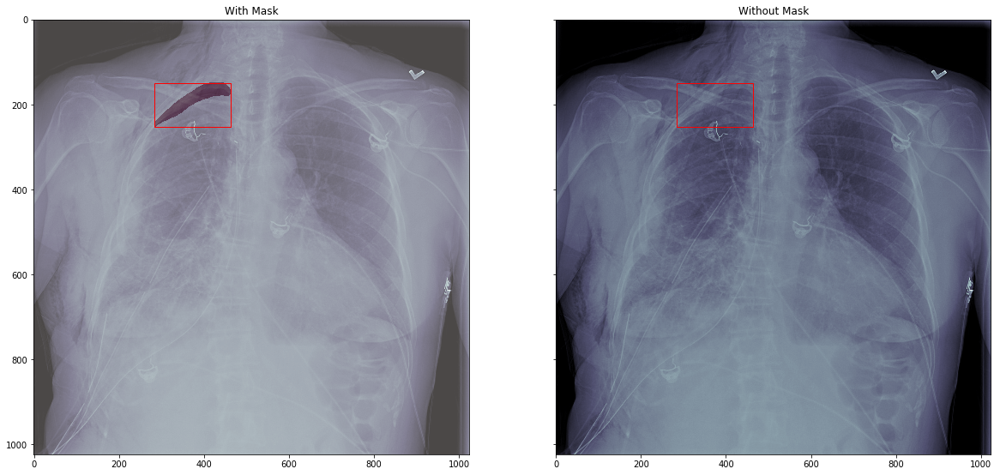

# [VinBigData Chest X-ray Abnormalities Detection](https://www.kaggle.com/c/vinbigdata-chest-xray-abnormalities-detection/data)

## Similar competitions
1. [RSNA Pneumonia Detection Challenge](https://www.kaggle.com/c/rsna-pneumonia-detection-challenge)

**In this competition, you’re challenged to build an algorithm to detect a visual signal for pneumonia in medical images. Specifically, your algorithm needs to automatically locate lung opacities on chest radiographs.**

2. [SIIM-ACR Pneumothorax Segmentation](https://www.kaggle.com/c/siim-acr-pneumothorax-segmentation)

**In this competition, you’ll develop a model to classify (and if present, segment) pneumothorax from a set of chest radiographic images. If successful, you could aid in the early recognition of pneumothoraces and save lives.**

3. [CheXpert](https://stanfordmlgroup.github.io/competitions/chexpert/)

## Top prize solution overview

## 1. [RSNA Pneumonia Detection Challenge](https://www.kaggle.com/c/rsna-pneumonia-detection-challenge)

### [1st place](https://www.kaggle.com/c/rsna-pneumonia-detection-challenge/discussion/70421)

- classification-detection pipeline
- 10-fold CV ensemble for classification, combination of 5 10-fold CV ensembles for detection (50 models)

For detection, we used:

- RetinaNet: https://github.com/fizyr/keras-retinanet
- Deformable R-FCN: https://github.com/msracver/Deformable-ConvNets
- Deformable Relation Networks: https://github.com/msracver/Relation-Networks-for-Object-Detection
- Boxes were ensembled using: https://github.com/ahrnbom/ensemble-objdet
- We resized the lengths and widths of our final predictions by 87.5%
- We found that a 6-model ensemble with 1 InceptionResNetV2 for classification and 5 Deformable Relation - - Networks achieved 0.253 on stage 2 private LB

### [2nd place](https://www.kaggle.com/c/rsna-pneumonia-detection-challenge/discussion/70427)

### [3rd place](https://www.kaggle.com/c/siim-acr-pneumothorax-segmentation/discussion/107981)

## 2. [SIIM-ACR Pneumothorax Segmentation](https://www.kaggle.com/c/siim-acr-pneumothorax-segmentation)

### [1st place](https://www.kaggle.com/c/siim-acr-pneumothorax-segmentation/discussion/107824)

### [2nd place](https://www.kaggle.com/c/siim-acr-pneumothorax-segmentation/discussion/108009)

## VinBigData current top solutions

### [LB 0.155](https://www.kaggle.com/c/vinbigdata-chest-xray-abnormalities-detection/discussion/208837)
[detection]
dataset
  - no external data
  - image resolution: 512x512
  - use only abnormal images (remove class 14)
model
  - sparse rcnn
  - use this repo: https://github.com/PeizeSun/SparseR-CNN
  - encoder: resnet34(imagenet pretrained)
  - others: random initialize
train
  - single fold
  - augmentation: hflip, scale, shift, random brightness/contrast
  - cls loss: focal loss, regression loss: l1 and giou loss
  - epochs: 60
  - optimizer: Adam
  - scheduler: cosine annealing

[classification]
classify abnormal image
dataset
 - no external data
 - image resolution: 512x512
 - use all images
model
  - resnet50(imagenet pretrained)
 train
  - 5fold
  - augmentation: hflip, scale, shift, rotate, random brightness/contrast
  - loss: bce
  - epochs: 15
  - optimizer: Adam
  - scheduler: cosine annealing

CV: 0.332, LB: 0.155

### [LB 0.175](https://www.kaggle.com/c/vinbigdata-chest-xray-abnormalities-detection/discussion/213462)
- source code based on: mmdet

- network architecture: VFNet

- Images scale: 1024x1024.

- Image augmentation: Rotation, Shift, Brightness, Contrast, Equalize.

- Boxes fusion: nms

- epoch: 48

### [LB 0.201](https://www.kaggle.com/c/vinbigdata-chest-xray-abnormalities-detection/discussion/210351)
- 2 class filter with threshold

